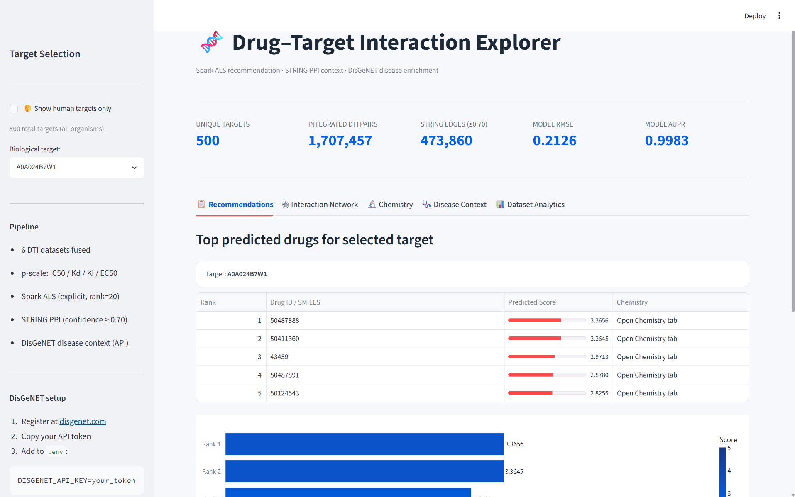
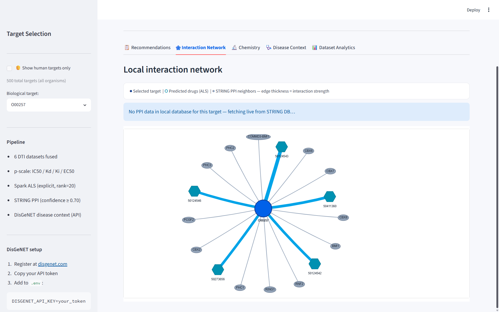
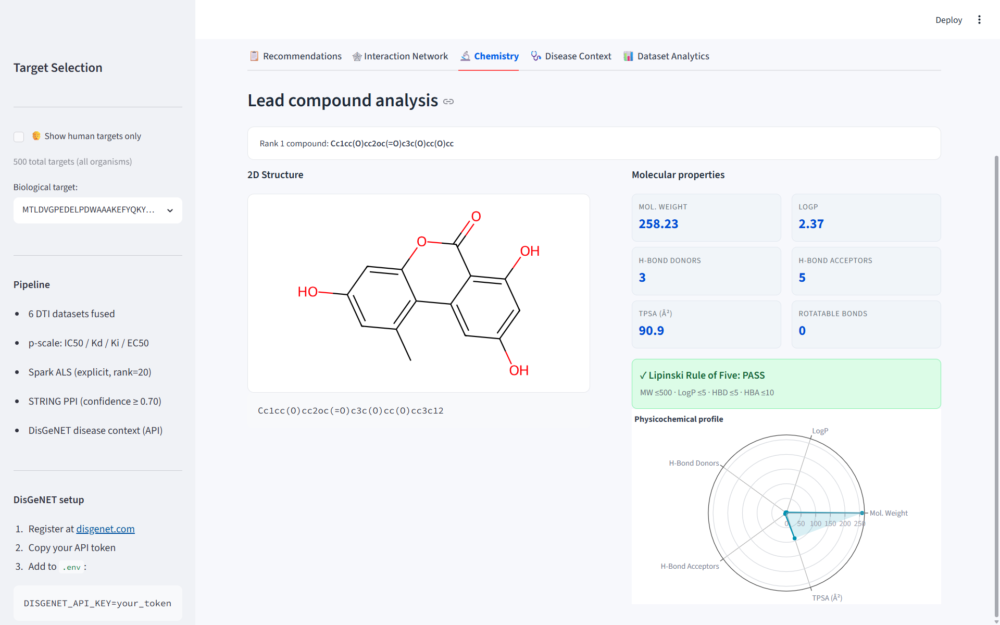
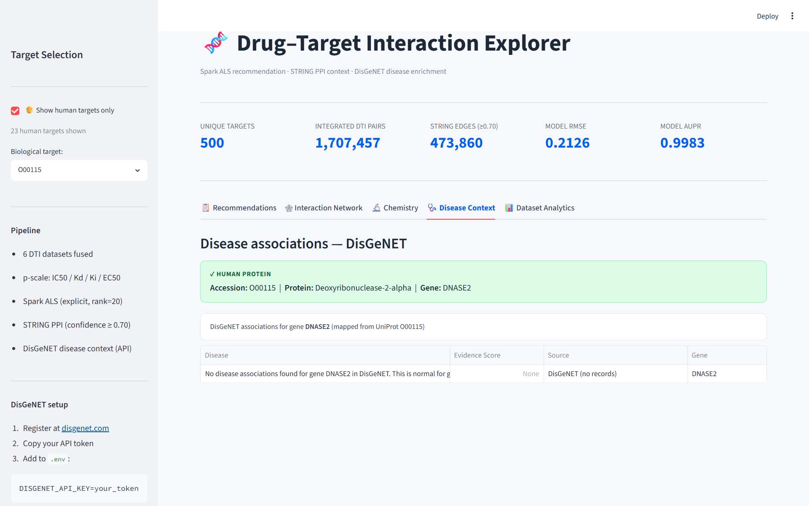
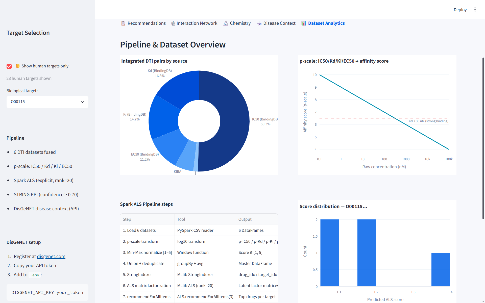
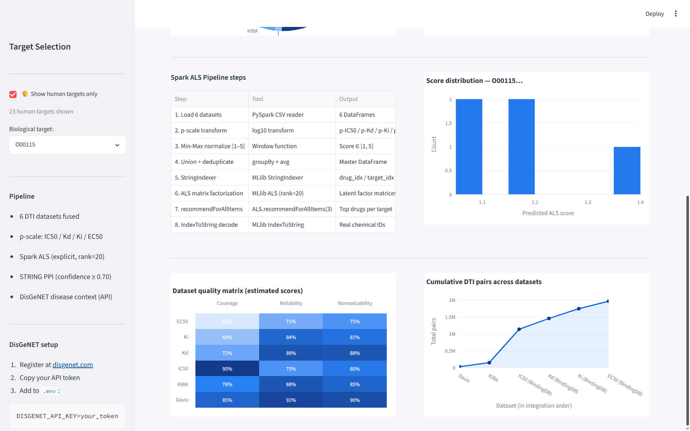
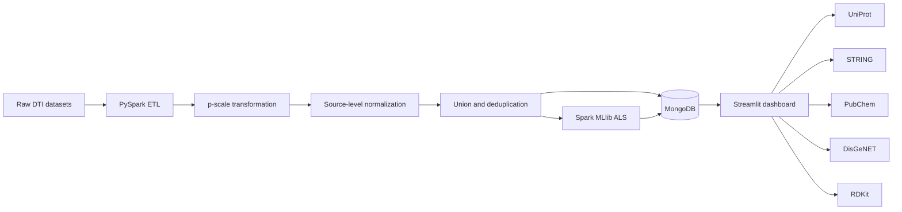

# 🧬 Drug–Target Interaction Explorer

<p align="center">
  
  
  
  
</p>

<p align="center">
  
  
  
  
</p>

An end-to-end **bioinformatics and big-data application** for exploring drug–target interaction (DTI) data, generating ranked candidate compounds with **Apache Spark ALS**, and enriching predictions with protein-network, chemistry, and disease context.

> **Status:** Local research/demo application. The Streamlit dashboard is intentionally not deployed online; screenshots below were captured from a populated local MongoDB instance.

---

## Table of Contents

- [Overview](#overview)
- [Dashboard Preview](#dashboard-preview)
- [Architecture](#architecture)
- [Data Pipeline](#data-pipeline)
- [Model and Evaluation](#model-and-evaluation)
- [Current Local Run](#current-local-run)
- [Features](#features)
- [Repository Structure](#repository-structure)
- [Installation](#installation)
- [Configuration](#configuration)
- [Running the Pipeline](#running-the-pipeline)
- [Testing](#testing)
- [Limitations](#limitations)
- [Roadmap](#roadmap)
- [Author](#author)

---

## Overview

This project frames drug–target interaction analysis as a **recommendation problem**.

It integrates heterogeneous biological affinity datasets, converts concentration-based measurements to a common p-scale, normalizes scores across sources, stores processed data in MongoDB, and trains an explicit-feedback **Spark MLlib ALS** model. A Streamlit dashboard lets users inspect ranked candidate compounds for a selected biological target.

The application combines model output with scientific context:

- **Recommendations:** top-ranked compounds for a selected target.
- **Interaction Network:** selected target, predicted compounds, and STRING PPI neighbors.
- **Chemistry:** RDKit molecular rendering and physicochemical properties.
- **Disease Context:** UniProt mapping and optional DisGeNET enrichment for human targets.
- **Dataset Analytics:** source composition, normalization, pipeline stages, and score distributions.

This project was developed in an academic **Big Data Management** context and extended into an interactive bioinformatics explorer.

---

## Dashboard Preview

### Recommendation Results

The recommendations view displays the selected target, top-five ALS candidates, predicted scores, ranking visualization, score decay, and CSV export.



### Interaction Network

The network view shows the selected target, ALS-recommended compounds, and STRING protein–protein interaction neighbors. Edge thickness represents predicted score or network confidence, depending on the data source.



### Compound Chemistry

The chemistry view resolves a lead compound where possible, renders its 2D molecular structure with RDKit, calculates physicochemical properties, and evaluates the Lipinski Rule of Five.



### Disease Context

For human UniProt targets, the application maps the selected accession to a gene symbol and queries DisGeNET when an API key is available. When no association is returned, the dashboard shows that result explicitly.



### Dataset Analytics

The analytics dashboard visualizes source composition and the affinity p-scale transformation.



It also documents the Spark ALS workflow, selected-target score distribution, source-quality annotations, and cumulative data volume.



---

## Architecture



| Layer | Responsibility | Main technologies |
|---|---|---|
| Data integration | Load, transform, normalize, merge, and deduplicate affinity data | PySpark, Spark SQL |
| Model training | Learn latent drug–target factors and generate candidate rankings | Spark MLlib ALS |
| Serving storage | Store integrated records, predictions, metrics, and PPI edges | MongoDB |
| Scientific enrichment | Resolve protein, network, chemistry, and disease information | UniProt, STRING, PubChem, DisGeNET, RDKit |
| Interactive dashboard | Explore predictions, visualizations, and exports | Streamlit, Plotly, PyVis |

---

## Data Pipeline

### 1. Source integration

The ETL pipeline is designed to integrate six DTI data sources:

- Davis
- KIBA
- BindingDB IC50
- BindingDB Kd
- BindingDB Ki
- BindingDB EC50

### 2. Affinity transformation

For concentration-based measurements, lower nanomolar concentrations correspond to stronger binding. The pipeline uses the following transformation:

\[
p\text{-scale} = 9 - \log_{10}(\text{concentration in nM})
\]

Davis and KIBA affinity values are treated as directional source scores. Each source is normalized to the configured range `[1, 5]` before integration.

### 3. Integration and deduplication

Records are grouped by:

```text
(DrugID, TargetID)
```

When the same pair appears in multiple sources, the pipeline aggregates normalized scores and preserves source-level evidence metadata.

### 4. STRING protein network

The pipeline can load STRING human protein interaction links, convert combined scores to `[0, 1]`, and retain edges with confidence of at least `0.70`.

### 5. ALS recommendation workflow

The modeling pipeline:

1. Selects `DrugID`, `TargetID`, and `NormalizedScore`.
2. Encodes string identifiers with `StringIndexer`.
3. Creates a seeded train/test split.
4. Trains an explicit-feedback ALS model.
5. Calculates RMSE and a thresholded AUPR metric.
6. Generates the top five drug candidates for each target.
7. Decodes indexed identifiers back to original IDs.
8. Stores metrics and recommendations in MongoDB.

---

## Model and Evaluation

The model uses **Apache Spark MLlib ALS** in explicit-feedback mode:

```text
Algorithm: ALS
Mode: Explicit feedback
Rating column: NormalizedScore
Rank: 20
Regularization: 0.05
Iterations: 15
Cold-start strategy: drop
```

### Evaluation interpretation

- **RMSE** is calculated against held-out normalized affinity scores.
- **AUPR** is calculated after converting `NormalizedScore >= 3.0` into a positive label.

The AUPR value is a thresholded auxiliary metric. It should not be interpreted as proof of clinical efficacy or confirmation that every predicted compound is a novel validated therapeutic candidate.

A grouped cold-start evaluation by target or drug would be a stronger next-stage evaluation strategy.

---

## Current Local Run

The dashboard screenshots were captured from a populated local run with the following metrics:

| Metric | Value |
|---|---:|
| Unique targets | 500 |
| Integrated DTI pairs | 1,707,457 |
| STRING edges with confidence ≥ 0.70 | 473,860 |
| Model RMSE | 0.2126 |
| Model AUPR | 0.9983 |

> Values depend on the exact dataset snapshot, preprocessing run, MongoDB contents, and model configuration.

---

## Features

### Recommendation Explorer

- Select from all available targets or filter to human targets.
- View five ALS-ranked candidate compounds.
- Inspect predicted scores and rank.
- Export recommendations to CSV.
- Review ranking and score-decay visualizations.

### Interaction Network

- Visualize the selected target as the central node.
- Display ALS-recommended compound nodes.
- Display stored STRING PPI neighbors.
- Use a live STRING fallback when local PPI edges are unavailable.
- Encode association strength through edge style and width.

### Chemistry Analysis

- Support direct SMILES and numeric candidate identifiers.
- Attempt PubChem and BindingDB cross-reference resolution.
- Render 2D molecular structures using RDKit.
- Calculate molecular weight, LogP, H-bond donors/acceptors, TPSA, and rotatable bonds.
- Check the Lipinski Rule of Five.

### Disease Context

- Retrieve UniProt protein metadata.
- Determine whether the selected target is human.
- Map human protein accessions to gene symbols.
- Query DisGeNET when `DISGENET_API_KEY` is configured.
- Present no-result, non-human, authentication, and rate-limit states clearly.

### Dataset Analytics

- Display DTI source proportions.
- Visualize the concentration-to-p-scale transformation.
- Document the Spark ALS workflow.
- Display score distributions for the selected target.
- Show cumulative pair counts across integrated datasets.
- Present dataset-quality annotations.

---

## Repository Structure

```text
DrugTarget-Recommender-Spark/
├── data/
│   ├── raw/                       # Local raw datasets; intentionally not committed
│   └── sample/                    # Optional future small demo data
├── docs/
│   └── images/                    # Dashboard screenshots
├── src/
│   ├── database/
│   │   └── mongo_client.py        # MongoDB access helpers
│   ├── frontend/
│   │   └── app.py                 # Streamlit dashboard
│   ├── modeling/
│   │   └── als_recommender.py     # Spark ALS training and recommendations
│   ├── preprocessing/
│   │   └── mongodb_loader.py      # DTI and STRING ETL
│   └── services/
│       ├── chemistry_service.py   # RDKit chemistry functionality
│       ├── disgenet_service.py    # DisGeNET client
│       ├── pubchem_service.py     # Compound lookup helpers
│       ├── string_service.py      # STRING API fallback
│       └── uniprot_service.py     # UniProt metadata client
├── tests/
│   └── test_chemistry_service.py  # Chemistry unit tests
├── .env.example                   # Safe configuration template
├── .gitignore
├── README.md
└── requirements.txt
```

---

## Installation

### Prerequisites

- Python 3.10 or newer
- Java compatible with the installed PySpark version
- MongoDB running locally
- Raw datasets under `data/raw/` for the complete ETL/training workflow

### Clone the repository

```bash
git clone [https://github.com/SaeidTadrisi/DrugTarget-Recommender-Spark.git](https://github.com/SaeidTadrisi/DrugTarget-Recommender-Spark.git)
cd DrugTarget-Recommender-Spark
```

### Create and activate a virtual environment

**Windows PowerShell**

```powershell
python -m venv .venv
.\.venv\Scripts\Activate.ps1
```

**Linux/macOS**

```bash
python3 -m venv .venv
source .venv/bin/activate
```

### Install dependencies

```bash
python -m pip install --upgrade pip
python -m pip install -r requirements.txt
```

---

## Configuration

Create your local configuration from the safe template:

**Windows PowerShell**

```powershell
Copy-Item .env.example .env
```

**Linux/macOS**

```bash
cp .env.example .env
```

Example `.env`:

```env
MONGO_URI=mongodb://localhost:27017/
MONGO_DB=bio_recommender_db

# Optional: needed only for live DisGeNET disease-association enrichment
DISGENET_API_KEY=
```

Do not commit `.env` or API tokens. The repository ignores `.env` and tracks only `.env.example`.

---

## Running the Pipeline

### Step 1 — Prepare the datasets

Place the required source files under:

```text
data/raw/
```

Expected file names and source-column mappings are defined in:

```text
src/preprocessing/mongodb_loader.py
```

### Step 2 — Run ETL and load MongoDB

```bash
python src/preprocessing/mongodb_loader.py
```

This loads and integrates DTI data and, when available, STRING PPI edges.

### Step 3 — Train ALS and generate recommendations

```bash
python src/modeling/als_recommender.py
```

This trains the model, evaluates it, produces top-five recommendations per target, and stores the outputs in MongoDB.

### Step 4 — Start the dashboard

```bash
streamlit run src/frontend/app.py
```

The dashboard requires populated MongoDB collections from the previous steps.

---

## Testing

The current unit tests focus on the RDKit chemistry layer:

- Valid SMILES recognition
- Invalid SMILES rejection
- Physicochemical property calculation
- Lipinski Rule of Five evaluation

Run all tests:

```bash
python -m pytest -q
```

Expected current output:

```text
4 passed
```

Run a Python syntax check:

```bash
python -m compileall src
```

---

## Limitations

- The current model evaluation uses a seeded random row split; this is a baseline rather than a full cold-start validation strategy.
- AUPR is thresholded from normalized affinity scores and is not a clinical or experimental validation metric.
- Candidate ranking should be treated as exploratory prioritization, not as proof of drug efficacy.
- External API results depend on service availability, rate limits, identifier coverage, and optional API credentials.
- Some compound identifiers cannot be resolved to valid molecular structures.
- The dataset-quality matrix contains estimated dashboard annotations; it is not an independently benchmarked data-quality study.
- Full raw datasets are not included because of size and/or source-distribution constraints.
- Docker support is intentionally not included in this repository; the project is designed for local execution.

---

## Roadmap

- Add mocked tests for UniProt, PubChem, STRING, DisGeNET, and MongoDB client behavior.
- Add a small reproducible MongoDB demo seed.
- Add grouped cold-start evaluation by target and drug.
- Add measured data-quality validation checks.
- Add structured logging and run metadata.
- Add optional containerized local development support if future portability requirements justify it.

---

## Author

**Saeid Tadrisi**

- GitHub: [SaeidTadrisi](https://github.com/SaeidTadrisi)